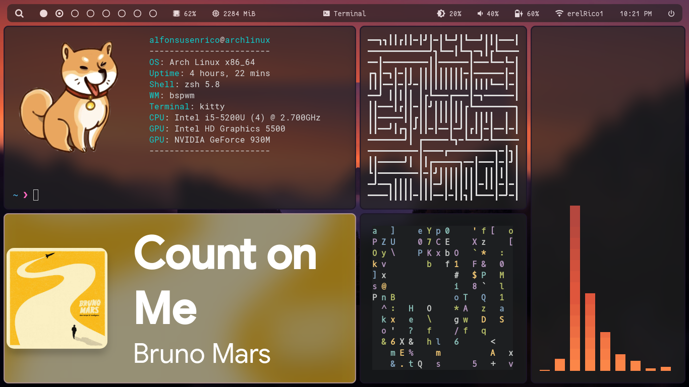

# Dotfiles
My BSPWM setup dotfiles

# Preview

# System
Arch Linux (kernel: zen, packages: pacman)

# What I use 
  - Cava
  - CMatrix
  - Compositor -> Picom (with experimental-backends flag)
  - File Manager -> Ranger
  - Login Screen -> LightDM (with lightdm-webkit2-greeter glorious theme)
  - Neofetch
  - Pipes.sh
  - Polybar
  - Spotify (Spicetify installed -> DribbblishDynamic Theme)
  - Sxhkd
  - Terminal Emulator -> Kitty
